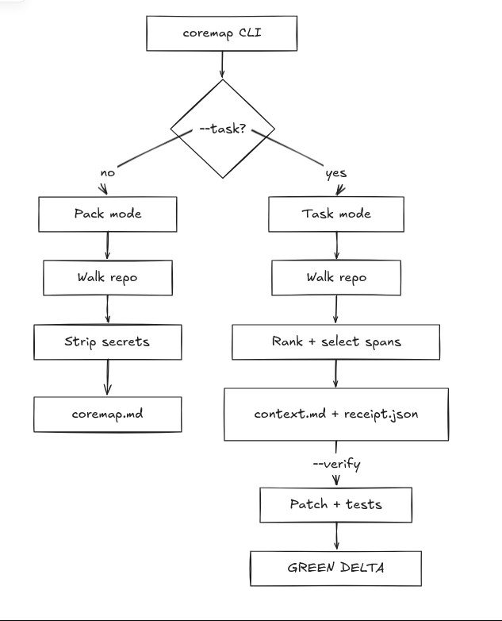

# CoreMap

Pack your repository into one AI-friendly file — or pass a task and keep only the lines that matter.

```bash
npx @0xanand/coremap .
```

Writes `coremap.md`: directory tree, source files, and a short summary. Secrets are excluded.

[](https://www.npmjs.com/package/@0xanand/coremap)
[](https://nodejs.org)
[](./LICENSE)

---

## Two modes

| Mode | Command | Output |
|------|---------|--------|
| **Pack** | `coremap .` | Full repo → one file (`coremap.md`) |
| **Task** | `coremap . --task "fix …"` | Exact spans → `coremap-context.md` + `coremap-receipt.json` |

Pack is the everyday path. Task mode selects a small evidence set and can verify it by applying a patch and running your tests.

---

## Install

**No install** (recommended):

```bash
npx @0xanand/coremap .
```

**Global:**

```bash
npm install -g @0xanand/coremap
coremap .
```

Requires **Node.js 20+**.

---

## Usage

### Pack mode

```bash
coremap .                          # → coremap.md
coremap . --out-file context.md    # custom name
coremap . --max-tokens 200000      # raise whole-file budget
coremap . --out-dir ./out          # write elsewhere
```

### Task mode

```bash
coremap . --task "fix the tax bug" --budget-lines 25

# Optional: prove the context was enough
coremap . --task "fix the tax bug" --verify
coremap . --task "…" --verify --no-llm   # offline (no API key)
```

Pinned demo (included in this repo):

```bash
npm run demo
```

Example output:

```
                          Full  Compress   CoreMap
--------------------  --------  --------  --------
Context tokens             432        81       192
HitFile                      —         —      1.00
HitRegion≈                   —         —      0.71
Patch produced              no        no       yes
Tests (original repo)        no        no       yes

coremap: GREEN DELTA  tokens 432→192  |  HitFile=1.00  |  HitRegion≈0.71  |  tests=PASS
```

`Tests (original repo)` is the same baseline for the Full and Compress columns; CoreMap applies the demo oracle patch only in an isolated temporary copy.

---

## Features

- **One command** — pack a repo in seconds
- **Git-aware** — respects `.gitignore` and optional `.coremapignore`
- **Secret-safe** — path + content filters (keys, tokens, PEMs, etc.)
- **Real token counts** — js-tiktoken `o200k_base`
- **Exact spans** — path + line ranges with real source (task mode)
- **Verification receipt** — optional patch + tests (`--verify`)
- **Works offline** — pack and selection need no API key

---

## CLI reference

```
Usage: coremap [options] [path]

Arguments:
  path                        repository path (default: ".")

Options:
  --task <text>               issue / change request (enables task mode)
  --budget-lines <n>          max source lines in the context pack (default: 200)
  --verify                    run one patch attempt + tests
  --no-llm                    offline selection; skip LLM patch
  --ground-truth <patch>      unified diff for HitFile / HitRegion scoring only
  --max-tokens <n>            pack mode whole-file token budget (default: 50000)
  --out-file <name>           pack mode output filename (default: coremap.md)
  --out-dir <dir>             output directory (default: .)
  -V, --version               output version number
  -h, --help                  display help
```

| Flag | Mode | Notes |
|------|------|--------|
| `--task` | task | Turns on span selection + receipt |
| `--budget-lines` | task | Hard line budget for selected source |
| `--verify` | task | Patch attempt + test run |
| `--no-llm` | task | Never call OpenAI; use oracle if `--ground-truth` is set |
| `--ground-truth` | task | Eval only — never used as selection input |
| `--max-tokens` | pack | Skip huge files once the budget is hit |
| `--out-file` / `--out-dir` | both | Control where artifacts land |

---

## How it works

**Pack:** walk the tree (gitignore-aware) → filter secrets → emit tree + files + summary with token counts.

**Task:** parse the task → gather candidates (terms, symbols, imports, tests) → rank → select exact spans under the line budget → write pack + receipt → optionally verify.



---

## Project layout

```
src/
  cli.ts              # CLI entry
  index.ts            # library exports
  coremap/            # pack, select, receipt, verify, …
bin/coremap           # npm bin wrapper (optional; published bin is dist/cli.js)
fixtures/             # mini-repo + tax-bug eval fixture
evals/tax-bug/        # issue text + ground-truth patch
specs/coremap/        # product spec / plan / tasks
tests/                # vitest
```

---

## Development

```bash
git clone https://github.com/Anand-0037/coremap.git
cd coremap
npm install
npm test          # 22 tests
npm run build
npm run lint
npm run pack      # dogfood: pack this repo → repomap.txt
npm run demo      # GREEN DELTA on the pinned eval
```

### Scripts

| Script | Purpose |
|--------|---------|
| `npm test` | Run vitest |
| `npm run build` | Compile TypeScript → `dist/` |
| `npm run coremap` | Run CLI via tsx |
| `npm run pack` | Full pack of this repo |
| `npm run demo` | Pinned task + verify demo |

### Ignore rules

CoreMap respects `.gitignore`. Add a `.coremapignore` (gitignore syntax) for extra exclusions.

---

## Security

- Path patterns: `.env*`, keys, PEMs, credential filenames, and similar
- Content scan: private-key headers, `sk-…`, `AKIA…`, high-entropy secret-like assignments
- Matched files are skipped; secret contents are never written into the pack

Report security issues via GitHub Issues (or privately if you prefer).

---

## Contributing

1. Fork and create a branch
2. Keep changes small and typed (`strict` TypeScript)
3. Add or update a vitest for behavior you change
4. Run `npm test && npm run build` before opening a PR

Bug reports and PRs are welcome.

---

## License

[MIT](./LICENSE)

---

Built for the OpenAI Codex Build Week hackathon (Delhi NCR). See [`CODEX.md`](./CODEX.md). Agent rules: [`AGENTS.md`](./AGENTS.md).
